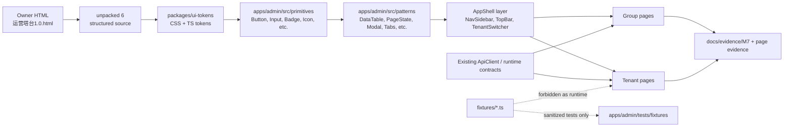

# UZMAX Admin UI Prototype Migration Index

> Status: M7-UI-00 docs-only migration index.
> Scope: owner prototype HTML and `/Users/atilla/源码/unpacked 6` to repo migration planning.
> Non-scope: implementation, raw prototype import, fixture import, release approval.

## 1. Source Priority And Boundary

| Layer | Source | Migration Use | Boundary |
|---|---|---|---|
| Visual source | `/Users/atilla/Downloads/运营塔台1.0.html` | Final visual comparison source for spacing, hierarchy, density and interaction expression. | Do not copy large HTML text into repo docs; do not commit bundled runtime. |
| Structured source | `/Users/atilla/源码/unpacked 6` | Primary file-level migration map for tokens, primitives, patterns, shell, pages, hooks and fixtures. | Read-only frozen input; do not modify, move, format or submit. |
| Repo design contract | `docs/admin-design-system.md`, `DESIGN.md` | Normalizes prototype values into UZMAX governance language and design rules. | Does not override AGENTS, v1.1 scope, security, permissions or release gates. |
| v1.1 admin IA | `UZMAX智能运营系统-后台设计与前端架构-v1.1.md` | Authoritative page order and workflow boundary. | Old visual-shell values are historical after M7-05. |
| Current implementation | `apps/admin/**`, `packages/ui-tokens/**` | Legacy shell/runtime baseline and existing ApiClient/test anchors. | Not a visual target for new M7+ UI; do not copy old `--uzmax-*` design debt forward. |

Key conclusion: `unpacked 6` is a useful source-shaped handoff, but it cannot be imported wholesale. It uses fixture-backed hooks, local `useState` write simulations and direct prototype values. Production migration must keep the visual structure while replacing runtime/data paths with UZMAX ApiClient/hook contracts, permissions, evidence states and sanitized tests.

## 2. `unpacked 6` To Repo Layer Mapping

| Source path | Target repo layer | Migration decision | Notes |
|---|---|---|---|
| `ui-tokens/tokens.css` | `packages/ui-tokens/src/tokens.css` | Must adapt | Replace/extend legacy `--uzmax-*` bridge with canonical `--ink-*`, `--state-*`, `--s-*`, `--radius-*`, motion, z-index and typography tokens. Preserve prototype values; do not leave pages with raw hex/px. |
| `ui-tokens/tokens.ts` | `packages/ui-tokens/src/tokens.ts` or package exports | Must adapt | Repo package currently exposes only `tokenPackage`; add typed token exports only under a token-foundation spec. No business imports. |
| `primitives/*.tsx` | `apps/admin/src/primitives/` | Can borrow component anatomy; must adapt implementation | Includes `Button`, `StatusBadge`, `Avatar`, `Toggle`, `Input`, `SearchInput`, `Select`, `Textarea`, `Chip`, `Kbd`, `Checkbox`, `SlaCountdown`, `CountBadge`, `Icon`, `Heartbeat`. Ensure no raw literals outside tokenized implementation and no mixed icon sources. |
| `primitives/primitives.css` | `apps/admin/src/primitives/primitives.css` | Must adapt | Useful for hover/focus/pulse rules; convert to repo class conventions and reduced-motion rules. Import once from app entry or shell after token package lands. |
| `patterns/*.tsx` | `apps/admin/src/patterns/` | Can borrow structure; must adapt states | Includes `NavItem`, `Tabs`, `MessageBubble`, `DataTable`, `ConfirmModal`, `Dropdown`, `BatchBar`, `EmptyState`, `MetricCard`, `DegradedBar`, `Toast`, `PageState`. Add loading/empty/error/permission/degraded contracts where missing. |
| `shell/AppShell.tsx` | `apps/admin/src/shell/AppShell.tsx` or equivalent AppShell layer | Must adapt | Preserve left rail/topbar/tenant switcher structure. Replace local route state with repo router plan only in a later implementation spec. Tenant switch must reload permissions/flags when real runtime exists. |
| `shell/NavSidebar.tsx` | `apps/admin/src/shell/NavSidebar.tsx` | Must adapt | Preserve `68px` collapsed and `232px` expanded prototype rail. Align tenant nav order to v1.1 IA, not prototype grouping when they differ. |
| `shell/TopBar.tsx` | `apps/admin/src/shell/TopBar.tsx` | Must adapt | Keep breadcrumb/layer, tenant control, env marker, heartbeat, search, notification and user menu. Search/notifications remain disabled or wired to real APIs, not fake local results. |
| `shell/TenantSwitcher.tsx` | `apps/admin/src/shell/TenantSwitcher.tsx` | Must adapt | Visual row structure is useful. Real implementation must filter by authorization and clear tenant-scoped cache on switch. |
| `shell/navigation.ts` | `apps/admin/src/shell/navigation.ts` | Must adapt | Group nav maps well; tenant nav must be ordered by v1.1: conversations, tickets, customer assets, orders, knowledge/resources, confirmation queue, eval, AI members, team, config, analytics, logs. |
| `pages/**` | `apps/admin/src/pages/**` | Must adapt | Page anatomy and micro-interactions are useful, but every page currently depends on fixtures or local hooks. Page workers must connect real ApiClient/hook and state matrix before acceptance. |
| `hooks/use*.ts` | Page-level hooks or existing ApiClient adapters | Reference only | Keep signatures as migration hints. Replace bodies with TanStack Query / existing ApiClient / runtime feature flags. Do not keep local `useState` write simulations as production behavior. |
| `fixtures/*.ts` | `apps/admin/tests/fixtures/**` or docs/evidence only | Forbidden for runtime; sanitized tests only | May contain demo customer/order/contact/persona values. Requires a fixture-sanitization map before any copy. No real-looking personal/order/phone/account data in runtime source. |
| `App.tsx` | `apps/admin/src/App.tsx` or router entry | Must adapt | Useful as full-site assembly map. Do not replace existing repo `App.tsx` without a dedicated AppShell/page routing spec. |
| `README.md` | `docs/evidence/M7/**` / migration notes | Reference only | Its "directly move into repo" instruction is not sufficient under AGENTS. Use this index as the governance-normalized version. |
| `.DS_Store`, bundled HTML runtime, generated support code | none | Forbidden | Never import, commit, format or use as runtime source. |

## 3. Current Repo Baseline

| Repo layer | Current state | Migration implication |
|---|---|---|
| `packages/ui-tokens` | `tokens.css` has legacy `--uzmax-*` bridge only; `index.ts` exports a package marker. | Foundation must land canonical prototype tokens before pages. |
| `apps/admin/src/primitives` | Directory does not exist. | Must be created by a foundation/primitives worker before page migration. |
| `apps/admin/src/patterns` | Directory does not exist. | Must be created after primitives and before AppShell/pages. |
| `apps/admin/src/App.tsx` | M2-M6 legacy shell assembly with old rail/topbar and milestone panels. | Treat as baseline/evidence, not visual source. Replacement must preserve existing runtime anchors intentionally. |
| `apps/admin/src/*ApiClient.ts` | Existing clients for confirmation queue, customer assets, order import, AI member runtime, logs analytics and template copy. | Page workers must reuse or extend these instead of keeping fixture hooks. |
| `apps/admin/tests/**` | M5/M6 tests target current `data-testid` contracts and release-gate/runtime wiring. | Migration workers need focused tests and may need test contract updates without weakening assertions. |
| `docs/admin-design-system.md` | Prototype-derived design system exists. | Use as normalization layer when `unpacked 6` raw values and AGENTS/design rules conflict. |

## 4. Component Dependency Graph

Migration order must follow the graph. Page work before tokens/primitives/patterns would recreate page-local styling and violate the prototype's shared design-system shape.

## 5. Page Inventory And Migration Priority

Decision key:

- `直接搬`: structure/visual anatomy can be borrowed with tokenized imports and repo naming.
- `必须适配`: cannot land as-is; requires real ApiClient/hook, permission and state wiring.
- `禁止搬`: source may not enter repo runtime; only sanitized evidence/test derivative may be used.

No page is a whole-file direct import candidate. Every page below is `必须适配` because `unpacked 6/pages/**` is coupled to fixtures or local state hooks.

| Priority | Page ID | v1.1 IA page | Source file | Decision | Required adaptation |
|---:|---|---|---|---|---|
| P1 | G-OVERVIEW | 集团总览 | `pages/group/GroupOverviewPage.tsx` | 必须适配 | Keep health strip/table density; wire to authorized group aggregate API only, no customer plaintext. |
| P2 | G-MODEL-RISK | 模型/成本/风险 | `pages/group/GroupModelPage.tsx` | 必须适配 | Keep matrix/risk layout; connect model/cost/eval summaries; no LLM cost guesswork. |
| P3 | G-TEMPLATE | 模板中心 | `pages/group/GroupTemplatePage.tsx` | 必须适配 | Keep tab/card pattern; copy-to-tenant must be owner/permission gated and create independent version. |
| P3 | G-CONNECTION | 连接中心 | `pages/group/GroupConnectionPage.tsx` | 必须适配 | Keep connector cards; feature flags and ADR-B states must drive visibility. |
| P1 | G-RELEASE | 发布与验收 | `pages/group/GroupReleasePage.tsx` | 必须适配 | Preserve evidence-first console; GA-0/1.0 actions remain locked unless source-of-truth evidence and owner approval allow them. |
| P3 | G-TENANT | 租户管理 | `pages/group/GroupTenantPage.tsx` | 必须适配 | Tenant create/disable must use real audit/version path; no fixture tenant writes. |
| P3 | G-LOGS | 集团日志 | `pages/group/GroupLogsPage.tsx` | 必须适配 | Group audit logs only; exports must use controlled jobs, not direct local download. |
| P1 | T-CONVERSATIONS | 对话 | `pages/conversations/ConversationsPage.tsx` plus list/thread/composer/context components | 必须适配 | Use real conversation/ticket/customer/order/quote APIs or existing contracts; keep three-column layout, Business draft confirmation and AI trace boundaries. |
| P1 | T-TICKETS | 工单 | `pages/tickets/TicketsPage.tsx` | 必须适配 | Connect ticket claim/transfer/close APIs; close result and destination/explanation required. |
| P2 | T-CUSTOMERS | 客户资产 | `pages/customers/**` | 必须适配 | Replace customer fixtures with customer asset ApiClient; merge/split/anonymize need impact preview, permission and audit. |
| P2 | T-ORDERS | 订单 | `pages/orders/OrdersPage.tsx` | 必须适配 | Use order import/read clients; stale/import snapshot must not look live; import/rollback via controlled jobs. |
| P2 | T-KNOWLEDGE | 知识与资源 | `pages/knowledge/KnowledgePage.tsx` | 必须适配 | Use KB capability APIs and eval gates; public/private quick replies and asset storageRef/file_id boundaries explicit. |
| P1 | T-QUEUE | 确认队列 | `pages/queue/QueuePage.tsx` | 必须适配 | Use confirmationQueueApiClient/TanStack mutation; conflict diff cannot be bypassed; add loading/empty/error/permission/degraded. |
| P2 | T-EVAL | 评测中心 | `pages/evals/EvalPage.tsx` | 必须适配 | Use eval runner/gate evidence; fake timeout run state forbidden as runtime. |
| P2 | T-AI-MEMBERS | AI 成员 | `pages/agents/AgentsPage.tsx` | 必须适配 | Use aiMemberRuntimeApiClient; emergency stop/recovery/capability toggles require reason/audit and owner/gate boundaries. |
| P3 | T-TEAM | 团队 | `pages/team/TeamPage.tsx` | 必须适配 | Use authz/team APIs; role permission edits grouped by v1.1 domains; disabled/permission states explicit. |
| P3 | T-CONFIG | 配置 | `pages/config/ConfigPage.tsx` | 必须适配 | Every save creates version; rollback confirmation and audit required; no direct prompt/model route publishing without eval gate. |
| P3 | T-ANALYTICS | 分析 | `pages/analytics/AnalyticsPage.tsx` | 必须适配 | Fixed operational board plus dimension table; export as controlled job. |
| P3 | T-LOGS | 日志 | `pages/logs/LogsPage.tsx` | 必须适配 | Login/online/operation logs separated; high-risk rows link to controlled refs. |

Priority notes:

- P1 is the first usable migration surface after foundation because it covers global risk recognition, daily queue, conversation/ticket operations and release truth.
- P2 contains core data/AI/knowledge workflows that need stronger API and permission alignment before visual migration can be accepted.
- P3 pages are important but should not precede foundation or P1 because they depend on shared table/forms/modal primitives and stable AppShell navigation.

## 6. First-Phase Slice Recommendations

| Slice | Target | Must happen before | Required evidence |
|---|---|---|---|
| M7-UI-00 | This migration index | All implementation workers | This file, spec, evidence, no source changes. |
| M7-UI fixture/sanitization map | `fixtures/*.ts` -> sanitized test/evidence policy | Any page worker that wants to reuse fixture shape | List unsafe fixture categories, allowed synthetic fixture schema, forbidden runtime import rules. |
| M7-UI token foundation | `packages/ui-tokens` | primitives, patterns, AppShell, pages | Canonical CSS/TS tokens, legacy `--uzmax-*` bridge policy, no business imports, guard evidence. |
| M7-UI primitives | `apps/admin/src/primitives` | patterns and pages | Component state matrix: default/hover/focus/active/disabled/loading/error where applicable. |
| M7-UI patterns | `apps/admin/src/patterns` | AppShell/pages | DataTable, PageState, ConfirmModal, Tabs, Dropdown, DegradedBar, Toast and MessageBubble wired to primitives/tokens. |
| M7-UI AppShell/global frame | `apps/admin/src/shell` and app entry | page migration | v1.1 IA nav order, tenant switch permission/cache behavior, env marker, heartbeat, search/notification disabled or real-wired. |
| Page workers | `apps/admin/src/pages/**` | acceptance of individual pages | Real ApiClient/hook, loading/empty/error/permission/degraded states, tests, evidence, no fixture runtime. |

Page worker hard rules:

- Every migrated page must connect a real repo ApiClient/hook or explicitly documented read-only API contract, and must include loading, empty, error, permission denied and degraded behavior. A page that only renders `unpacked 6` fixtures is a prototype preview, not a repo migration.
- Owner HTML `/Users/atilla/Downloads/运营塔台1.0.html` and frozen `/Users/atilla/源码/unpacked 6` are the hard visual/source baseline. Current #182 direction is broadly aligned but not one-to-one visual acceptance, owner approval or merge readiness.
- Before implementation and before any visual acceptance claim, every page worker must inspect the exact target `/Users/atilla/源码/unpacked 6/pages/**` source, source components and the relevant owner HTML region. The source already contains layout/component details; do not invent layouts, freely rearrange UI or carry old shell visuals.
- Desktop acceptance is a parity check, not a loose similarity check. Workers must tune against the owner HTML and target unpacked source until remaining visual deltas are explicitly listed and accepted.
- Shared shell/sidebar acceptance must verify owner sidebar category grouping, item order, icon treatment, expanded/collapsed dimensions and the bottom collapse-sidebar control when the sidebar is visible.
- Mobile remains an acceptable/readable/no-overflow fallback for this migration phase; pixel-level mobile redesign/polish belongs to a later mobile-specific pass.
- Page workers may not spend current migration budget on creative re-layouts or mobile redesign unless a later spec explicitly changes this priority.
- Group and tenant layers remain separate: `/design` or admin/home opens group layer/group overview; selecting a tenant enters tenant layer.
- Release/acceptance remains transitional/low business value and must not displace high-value real admin pages.

## 7. Directly Borrow, Adapt, Forbid

### Directly Borrow As Design/Structure

- Token values from `ui-tokens/tokens.css` / `tokens.ts`, normalized through `docs/admin-design-system.md`.
- Lucide icon selection and stroke width `1.75`, after dependency/spec approval.
- AppShell anatomy: rail, topbar, tenant switcher, environment strip, heartbeat, search, notifications and user identity.
- Conversation three-column structure and AI trace/composer/customer-context relationships.
- Confirmation queue focused card flow, keyboard model, conflict diff requirement and recovery/degraded banner shape.
- High-risk confirmation modal pattern: consequence, reason, audit destination and disabled prerequisite.
- Dense table/list rhythms, mono data fields, status badges and degraded bars.

### Must Adapt Before Repo Runtime

- Import paths, package exports, CSS import order and route composition.
- Inline raw hex/px/ms values. Pages must use tokens/primitives/patterns; primitives/patterns may only contain token-resolved styling allowed by their implementation spec.
- Tenant navigation order: use v1.1 IA order even when prototype grouping puts confirmation queue earlier.
- Hooks: replace fixture `useState` stores with TanStack Query, existing ApiClient, server mutations, WebSocket cache patches or read-only runtime contracts.
- All write-like local operations: claim, transfer, close, publish, restore, rollback, import, export, emergency stop, recover, copy template and GA open must become controlled API/audit flows.
- State coverage: add or preserve loading, empty, error, permission denied and degraded state for every core page.
- Existing tests: update focused tests without `.skip`, assertion weakening or snapshot swelling.
- Current `apps/admin` runtime anchors: preserve useful ApiClient contracts and release-gate truth instead of overwriting them with prototype fixtures.

### Forbidden To Directly Enter Repo

- `/Users/atilla/源码/unpacked 6/.DS_Store`.
- Raw `/Users/atilla/Downloads/运营塔台1.0.html` contents, bundled runtime scripts, generated support code or large verbatim excerpts.
- Fixture data as runtime source, especially demo customer names, phone/account/order-like values, message text, raw prompt/completion, raw Telegram payload, URLs, secrets or provider keys.
- Local-only hook simulations that make formal writes look complete.
- Fake timers as production evidence for eval, import, AI member, order or confirmation queue operations.
- GA-0 / release open actions that bypass source-of-truth gates and owner approval.
- Old `--uzmax-*` tokens as the new visual target.
- Side-stripe card/list accents already rejected by M7 design governance.
- Any change to `unpacked 6`; it is a frozen read-only input.

## 8. Worker Handoff Checklist

Each follow-up worker should start by recording:

- assigned worktree and branch;
- `pwd`;
- `git status --short --branch`;
- `git branch --show-current`;
- target spec and touch list;
- whether `git branch --no-merged main` and `gh pr list --state open` are available.

Each implementation worker must report:

- source files searched with `rg` before adding new files;
- why the target layer was extended instead of creating a parallel implementation;
- exact mapping from `unpacked 6` source files to repo paths;
- exact owner HTML region or screenshot and target `unpacked 6/pages/**` files/components inspected for desktop pixel/detail acceptance;
- sidebar category grouping, item order, icon treatment, expanded/collapsed dimensions and bottom collapse-control parity result when the shell/sidebar is visible;
- 320px mobile readable/no-overflow fallback result, without claiming mobile pixel redesign;
- remaining desktop visual deltas and whether each is owner-accepted, runtime/permission/degraded-state justified, or still blocking visual acceptance;
- which fixture values were ignored, sanitized or converted to tests;
- which Impeccable/design-system suggestions were accepted, adapted or rejected and why;
- page state coverage and API/hook wiring evidence;
- `git diff --check` and `guard:pr-shape` result.

## 9. Open Questions For Coordinator

- Whether AppShell should land under `apps/admin/src/shell/**` or be flattened under `apps/admin/src/AppShell.tsx`; this index recommends `src/shell/**` to keep boundaries visible.
- Whether token foundation should introduce `tokens.ts` in `packages/ui-tokens/src/` or export typed tokens from `index.ts`; this should be decided by the token foundation spec.
- Whether page workers should preserve current `data-testid` names for continuity or introduce new IDs aligned to v1.1 page IDs; tests should not be weakened either way.
- Whether `lucide-react` is already acceptable as a dependency for the implementation slice; M7-05 did not introduce it.
